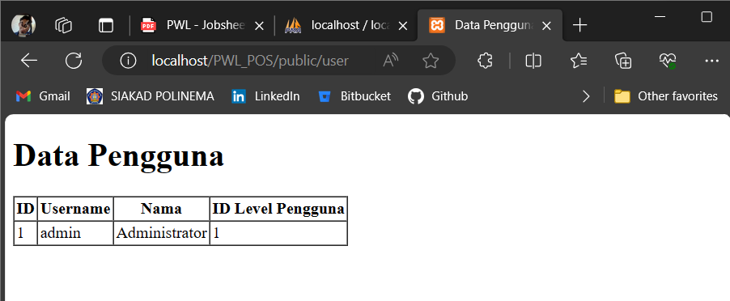

# Jobsheet 4: Model dan Eloquent Orm
> Nama  : Muhammad Fakhruddin Arif
>
> Kelas : TI-2F
>
> Nomor : 21

## Praktikum 1 - $fillable


Yang terjadi yaitu penambahan data berhasil karena value pada fillable dipenuhi


Yang terjadi yaitu error pada url tersebut dikarenakan key password tidak ada pada fillable

## Praktikum 2.1 - Retrieving Single Models

Data yang muncul yaitu hanya user dengan id 1


Data yang dihasilkan sama tetapi hanya beda pada penulisan eloquent orm saja


Data yang dihasilkan sama seperti sebelumnya berbeda pada penulisan source code saja


Data yang dihasilkan hanya username dan nama pada user id 1


Hasildari ini yaitu not found 404 dikarenakan data tidak lebih dari 20

## Praktikum 2.2 - Not Found Exceptions

Hasil dari source tersebut yaitu sama hanya berbeda pada syntax saja


Hasilnya yaitu 404 dikarenakan data dengan username "manager9" tidak ada dalam database

## Praktikum 2.3 - Retrieving Aggregrates

Hasil yang dihasilkan yaitu angka 2 yaitu hasil dari count tersebut dan tidak menampilkan page


## Praktikum 2.4 - Retreiving or Creating Models

Jika terdapat data maka tidak akan membuat data tersebut

Kemudian ini hasil ketika data tersebut tidak ada

Ketika tidak ada data maka akan membuat objek baru tetapi tidak disimpan ke database

Dan ini hasilnya ketika disave

## Praktikum 2.5 - Attribute Changes

Nilai null dikarenakan data telah tidak ada yang dirubah jadi bernilai false


Bernilai true dikarenakan terdapat username yang telah dirubah meskipun telah disimpan ke database perbaruannya

## Praktikum 2.6 - CRUD
Pada section ini terdapat sebuah button nantinya akan dapat menambahkan data dan ada tautan untuk update dan delete data

## Praktikum 2.7 - Relationships

Pada langkah ini akan ditampilkan hubungan one to one antara UserModel dengan Model Level menggunakan dd(dump and die). Terdapat 11 item yang menunjukkan hubungan kedua model.

[//]: # (# Jobsheet 3: Migration, Seeder, DB Facade, Query Builder, dan Eloquent ORM)

[//]: # (1. Pada Praktikum 1 - Tahap 5, apakah fungsi dari APP_KEY pada file setting .env Laravel?)

[//]: # (>`APP_KEY` pada file `.env` adalah kunci enkripsi digunakan untuk menjaga keamanan data sensitif dalam app)

[//]: # (2. Pada Praktikum 1, bagaimana kita men-generate nilai untuk APP_KEY?)

[//]: # (```php)

[//]: # (php artisan key:generate)

[//]: # (```)

[//]: # (3. Pada Praktikum 2.1 - Tahap 1, secara default Laravel memiliki berapa file migrasi?)

[//]: # (   dan untuk apa saja file migrasi tersebut?)

[//]: # (> Membuat tabel reset, menyimpan data user, menyimpan data failed job yang terjadi pada aplikasi, dan untuk menyimpan data token personal access)

[//]: # (4. Secara default, file migrasi terdapat kode $table->timestamps&#40;&#41;;, apa tujuan/output)

[//]: # (   dari fungsi tersebut?)

[//]: # (> Otomatis menambahkan kolom `created_at` dan `updated_at`)

[//]: # (5. Pada File Migrasi, terdapat fungsi $table->id&#40;&#41;; Tipe data apa yang dihasilkan dari)

[//]: # (   fungsi tersebut?)

[//]: # (> unsignedBigInteger)

[//]: # (6. Apa bedanya hasil migrasi pada table m_level, antara menggunakan $table->id&#40;&#41;;)

[//]: # (   dengan menggunakan $table->id&#40;'level_id'&#41;; ?)

[//]: # (> Perbedaan antara `$table->id&#40;&#41;;` dan `$table->id&#40;'level_id'&#41;;` dalam hasil migrasi pada tabel m_level adalah penamaan kolom primary key yang dihasilkan. Hasil jika tanpa params adalah `id` sedangkan hasil `$table->id&#40;'level_id'&#41;;` adalah `level_id`.)

[//]: # (7. Pada migration, Fungsi ->unique&#40;&#41; digunakan untuk apa?)

[//]: # (> Fungsi `->unique&#40;&#41;` pada migration digunakan untuk menetapkan kolom sebagai unik, yang berarti nilainya harus unik di antara setiap baris dalam tabel, mencegah duplikasi data pada kolom tersebut.)

[//]: # (8. Pada Praktikum 2.2 - Tahap 2, kenapa kolom level_id pada tabel m_user)

[//]: # (   menggunakan $tabel->unsignedBigInteger&#40;'level_id'&#41;, sedangkan kolom level_id)

[//]: # (   pada tabel m_level menggunakan $tabel->id&#40;'level_id'&#41; ?)

[//]: # (> Kolom level_id pada tabel m_user menggunakan `$table->unsignedBigInteger&#40;'level_id'&#41;` karena kolom ini berperan sebagai foreign key yang merujuk ke kolom id pada tabel `m_level`, yang secara default bertipe unsigned big integer. Sedangkan kolom level_id pada tabel m_level menggunakan `$table->id&#40;'level_id'&#41; `sebagai primary key.)

[//]: # (9. Pada Praktikum 3 - Tahap 6, apa tujuan dari Class Hash? dan apa maksud dari kode)

[//]: # (   program Hash::make&#40;'1234'&#41;;?)

[//]: # (> Class Hash digunakan untuk mengenkripsi data yang akan disimpan ke dalam database. Biasanya digunakan untuk mengenkripsi password.)

[//]: # (10. Pada Praktikum 4 - Tahap 3/5/7, pada query builder terdapat tanda tanya &#40;?&#41;, apa)

[//]: # (    kegunaan dari tanda tanya &#40;?&#41; tersebut?)

[//]: # (> Tanda tanya `&#40;?&#41;` pada query builder berperan sebagai placeholder untuk parameter yang akan diikuti saat query dieksekusi.)

[//]: # (11. Pada Praktikum 6 - Tahap 3, apa tujuan penulisan kode protected $table =)

[//]: # (    ‘m_user’; dan protected $primaryKey = ‘user_id’; ?)

[//]: # (> Penulisan protected `$table = 'm_user';` menunjukkan bahwa model terkait dengan tabel '`m_user'`, sementara protected `$primaryKey = 'user_id';` menetapkan bahwa `'user_id'` adalah primary key pada tabel tersebut.)

[//]: # (12. Menurut kalian, lebih mudah menggunakan mana dalam melakukan operasi CRUD ke)

[//]: # (    database &#40;DB Façade / Query Builder / Eloquent ORM&#41; ? jelaskan )

[//]: # (> Lebih mudah dengan menggunakan Eloquent ORM karena sesuai dengan konsep MVC yang membuat kode lebih mudah untuk dikelola dan dibaca)
